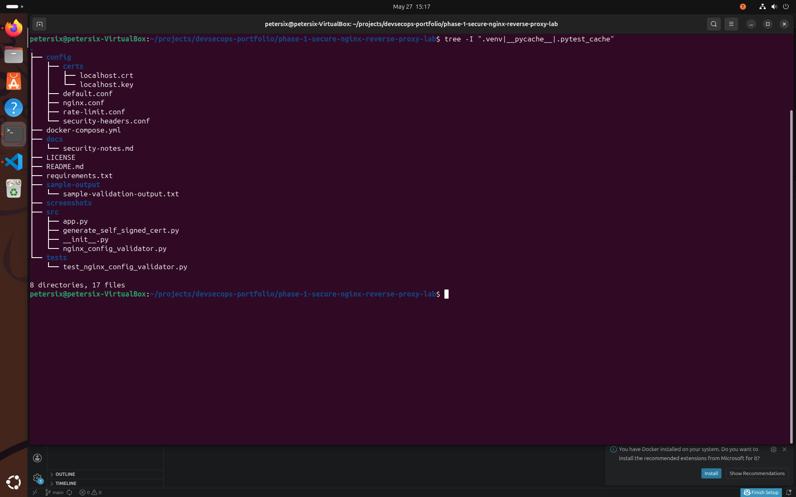
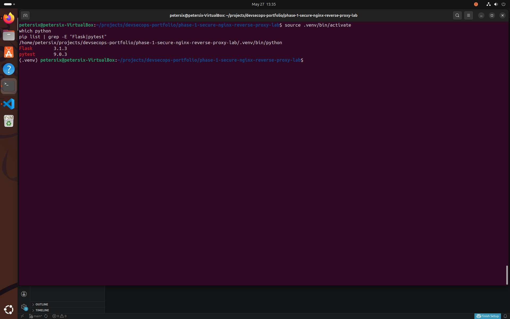
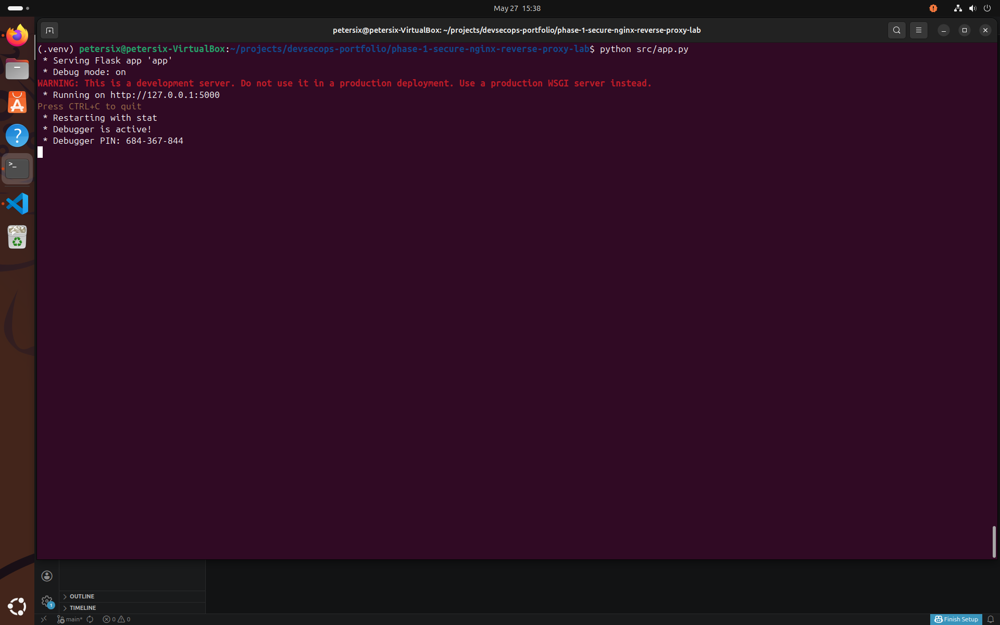
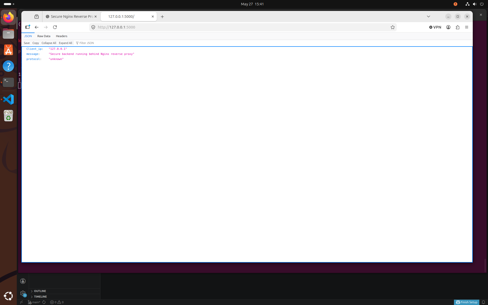
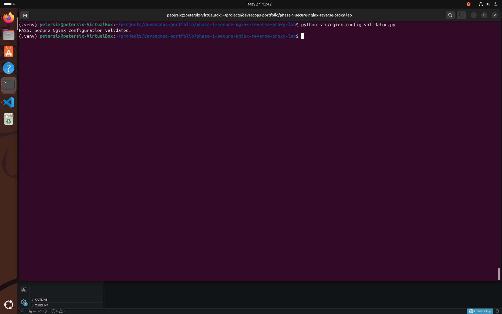
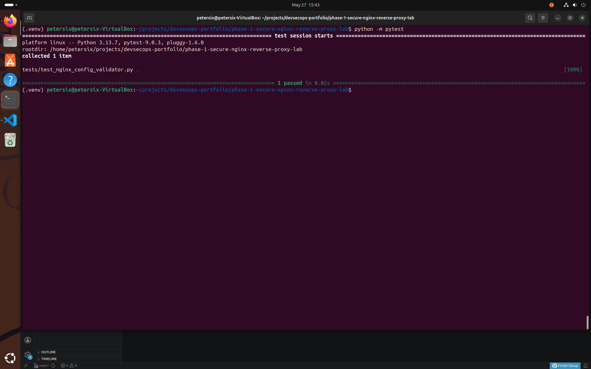
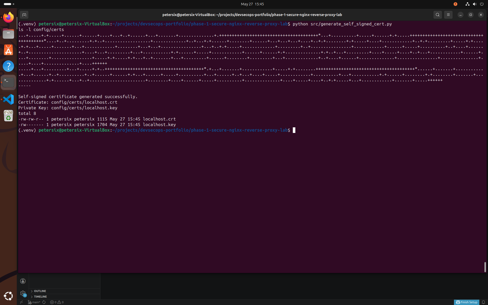
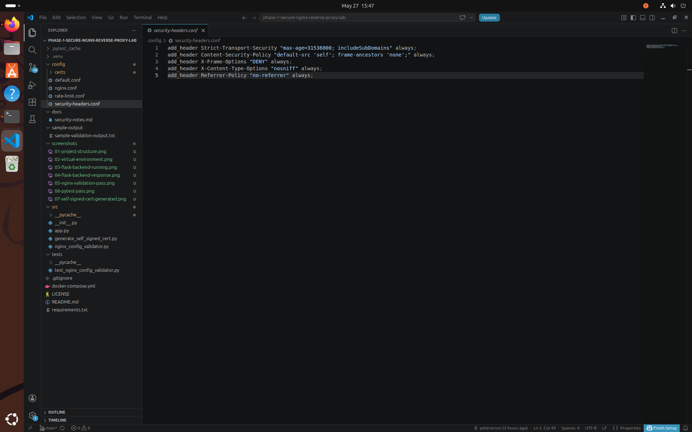
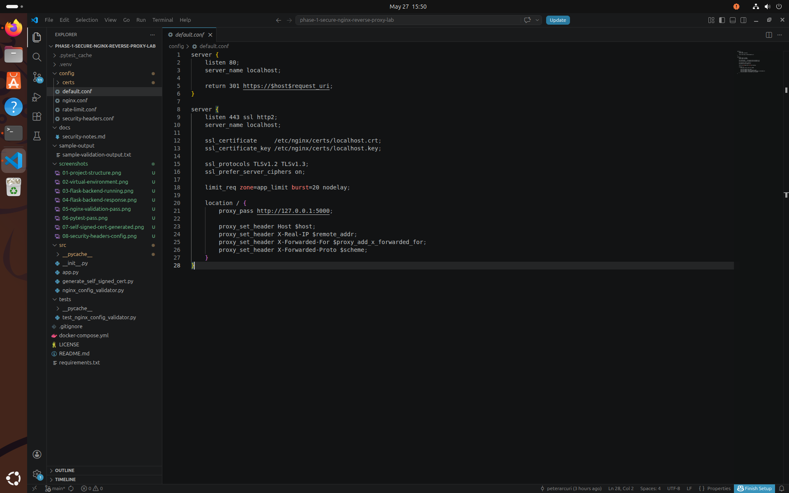
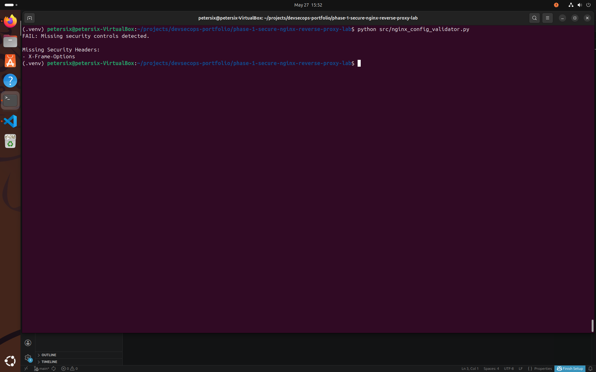

# Phase 1 — Secure Nginx Reverse Proxy Lab

A security-focused Nginx reverse proxy lab designed to strengthen practical DevSecOps skills in:

- Reverse proxy architecture
- TLS/SSL configuration
- HTTP security hardening
- Network traffic control
- Secure web infrastructure
- Rate limiting & attack mitigation

---

# Objectives

This project simulates a hardened reverse proxy deployment commonly used in real-world DevSecOps and cloud environments.

The lab focuses on:

- securing HTTP traffic
- enforcing TLS
- implementing security headers
- protecting backend applications
- understanding Layer 7 traffic flow

---

# Features

## Current Features

- Nginx reverse proxy configuration
- TLS/SSL hardening
- Security header enforcement
- Rate limiting
- HTTP → HTTPS redirection
- Basic attack surface reduction

---

## Planned Features

- Dockerized deployment
- Web Application Firewall (WAF) rules
- Fail2Ban integration
- Load balancing
- Prometheus metrics
- CI/CD validation pipeline

---

# Technologies Used

- Python
- Flask
- Nginx
- Pytest
- OpenSSL
- Linux
- VS Code

---

# Project Structure

```text
phase-1-secure-nginx-reverse-proxy-lab/
│
├── src/
├── tests/
├── docs/
├── config/
├── sample-output/
└── screenshots/
```

---

# Security Components

| File | Purpose |
|---|---|
| nginx.conf | Main Nginx configuration |
| default.conf | Reverse proxy site configuration |
| security-headers.conf | Secure HTTP header enforcement |
| rate-limit.conf | Traffic rate limiting configuration |

---

# Security Controls Implemented

- TLS encryption
- Strict Transport Security (HSTS)
- Content Security Policy (CSP)
- X-Frame-Options
- Rate limiting
- Secure proxy forwarding
- HTTPS redirection

---

# Security Considerations

This lab is intended strictly for:

- educational purposes
- local testing
- authorized environments
- DevSecOps training

Do not expose insecure test configurations publicly.

---

# Example Security Headers

```http
Strict-Transport-Security
Content-Security-Policy
X-Frame-Options
X-Content-Type-Options
Referrer-Policy
```

---

# Future Improvements

- Kubernetes ingress integration
- Terraform deployment
- Automated TLS renewal
- Grafana dashboards
- Runtime monitoring
- Container security scanning

---

# Long-Term DevSecOps Goals

This project will eventually integrate with:

- Docker containers
- CI/CD pipelines
- Terraform infrastructure
- Kubernetes clusters
- Monitoring & observability stacks

to simulate enterprise-grade DevSecOps workflows.

---

# Setup & Usage

## Create Virtual Environment

```bash
python3 -m venv .venv
source .venv/bin/activate
```

## Install Dependencies

```bash
pip install flask pytest
```

## Run Flask Backend

```bash
python src/app.py
```

## Run Security Validator

```bash
python src/nginx_config_validator.py
```

## Run Tests

```bash
python -m pytest
```

## Generate Self-Signed Certificates

```bash
python src/generate_self_signed_cert.py
```

---

# Skills Demonstrated

- Reverse proxy configuration
- TLS/SSL security
- HTTP hardening
- Rate limiting
- Secure proxy forwarding
- Python automation
- Security validation
- DevSecOps fundamentals
- Linux system administration
- Infrastructure security

---

# Screenshots

## Project Structure



---

## Virtual Environment



---

## Flask Backend Running



---

## Backend Response



---

## Nginx Validation Passed



---

## Pytest Passed



---

## Self-Signed Certificate Generated



---

## Security Headers Configuration



---

## Reverse Proxy Configuration



---

## Failed Validation Demo

